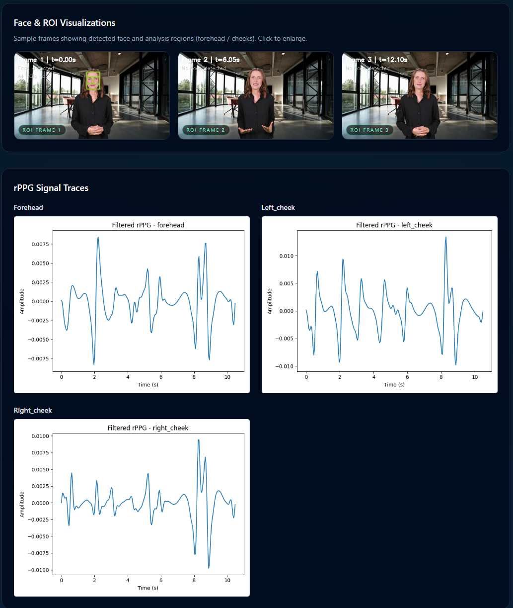

<div align="center">


<br />

### Invariant Deepfake Detection via Remote Photoplethysmography

*Authenticity as a biological requirement — not a visual classification problem.*

<br />

[](https://www.python.org/)
[](https://fastapi.tiangolo.com/)
[](https://reactjs.org/)
[](https://www.docker.com/)

[](https://www.postgresql.org/)
[](https://redis.io/)
[](https://opencv.org/)
[](./LICENSE)

<br />

[Report Bug](https://github.com/obsTR/BioVerify/issues) · [Request Feature](https://github.com/obsTR/BioVerify/issues)

</div>

<br />

<div align="center">

<br />

<br />
<sub><b>Evidence Dashboard</b> — Face & ROI visualizations with rPPG signal traces extracted from forehead and cheek regions.</sub>
</div>

<br />

---

## About

BioVerify is a complete video deepfake detection system that treats **authenticity as a biological requirement**.

Instead of chasing ever-shrinking pixel artifacts, BioVerify verifies the presence of **human life signals** using remote photoplethysmography (rPPG). It isolates subtle reflectance variations in facial skin regions caused by the cardiac cycle and asks a simple question:

> *Does this video contain a physiologically plausible, spatially coherent pulse signal?*

If the answer is no — or if the signal cannot be reliably observed — the system returns a **Synthetic** or **Inconclusive** verdict rather than a confident but ungrounded guess.

---

## Table of Contents

<details>
<summary>Click to expand</summary>

- [About](#about)
- [Why BioVerify?](#why-bioverify)
- [System Architecture](#system-architecture)
  - [Phase 1 — Signal Extraction & Quality Gating](#phase-1--signal-extraction--quality-gating)
  - [Phase 2 — Physiological Analysis](#phase-2--physiological-analysis)
- [Getting Started](#getting-started)
  - [Prerequisites](#prerequisites)
  - [One-Command Bring-Up](#one-command-bring-up-docker-compose)
  - [Initialize Storage](#initialize-storage-minio)
  - [Smoke Test](#smoke-test-end-to-end)
  - [Accessing Services](#accessing-services)
- [For Developers](#for-developers)
  - [Project Structure](#project-structure)
  - [Backend](#backend-api--worker)
  - [Frontend](#frontend-ui)
  - [Configuration](#configuration-summary)
- [Evidence & Diagnostics](#evidence--diagnostics)
- [API Reference](#api-reference)
- [Use Cases](#use-cases--positioning)
- [License](#license)
- [Author](#author)

</details>

---

## Why BioVerify?

Traditional deepfake detectors are locked in an arms race with generative models. As synthesis improves, visual defects vanish and **artifact-based detectors decay**.

BioVerify breaks this cycle by targeting **biological invariants**:

| Signal Property | What It Means |
|---|---|
| **Spatially coherent pulse** | rPPG extracts green-channel reflectance from regions like the forehead and cheeks |
| **Physiological plausibility** | Heart rate and harmonics must be consistent, human-range, and stable over time |
| **Spatial coherence** | Different skin regions must agree on the same underlying pulse, within tolerance |

Most deepfake pipelines do **not** simulate a realistic cardiovascular field. The **absence, inconsistency, or instability** of these signals is treated as model-agnostic evidence of synthesis.

### Key Properties

- **Model agnostic** — Effective across deepfake families (FaceSwap, NeuralTextures, CelebDF-like content) without retraining.
- **Passive liveness** — No user interaction, prompts, or challenge-response required. Works on existing video.
- **High assurance** — Optimized for **zero false positives** in high-risk domains. When observability is low, the system prefers **Inconclusive** over unsafe guesses.

---

## System Architecture

BioVerify is split into two conceptual phases plus infrastructure around them.

### Phase 1 — Signal Extraction & Quality Gating

The goal of Phase 1 is not classification; it is **observability**. If we cannot reliably see a biological signal, we **stop** and declare the sample Inconclusive (subject to policy).

```
Video Input
  │
  ├─ Ingest ─────────── Canonicalize video, compute timestamps, define windows
  │
  ├─ Face Detection ──── Detect & track face, define ROIs (forehead, cheeks)
  │
  ├─ ROI Stabilization ─ Warp face toward canonical pose, reduce motion noise
  │
  ├─ Spatial Pooling ─── Extract green-channel reflectance per ROI over time
  │
  └─ SQI Gate ────────── Evaluate SNR, motion, compression → pass / Inconclusive
```

### Phase 2 — Physiological Analysis

Only sufficiently clean signals reach this stage. The system applies domain-driven checks:

```
Clean rPPG Signal
  │
  ├─ Spectral Analysis ── FFT → dominant heart rate & peaks
  │
  ├─ Harmonic Ratio ───── Fundamental vs. harmonic components
  │
  ├─ Spatial Coherence ── Cross-region pulse agreement (frequency & phase)
  │
  └─ Temporal Stability ── HR consistency over time
                               │
                               ▼
                    Verdict: Human / Synthetic / Inconclusive
                    + Confidence Score + Audit Evidence
```

---

## Getting Started

### Prerequisites

| Requirement | Version |
|---|---|
| Docker & Docker Compose | Latest |
| Python | 3.11+ |
| Node.js | 18+ |

### One-Command Bring-Up (Docker Compose)

```bash
docker-compose up -d
```

This starts:

| Service | Purpose |
|---|---|
| **PostgreSQL** | Job tracking |
| **Redis** | Message broker |
| **MinIO** | S3-compatible object storage |
| **FastAPI** | API service (port `8000`) |
| **Celery** | Worker (runs the engine) |

### Initialize Storage (MinIO)

If you are using the bundled MinIO service:

```bash
docker-compose exec minio mc alias set local http://localhost:9000 minioadmin minioadmin

docker-compose exec minio mc mb local/bioverify
```

### Smoke Test (End-to-End)

```bash
python scripts/smoke_test.py
```

Uploads a sample video, waits for processing, and verifies that the engine, worker, storage, and API are wired correctly.

### Accessing Services

| Service | URL |
|---|---|
| API | `http://localhost:8000` |
| Swagger Docs | `http://localhost:8000/docs` |
| MinIO Console | `http://localhost:9001` |
| UI (dev mode) | `http://localhost:3000` |

---

## For Developers

### Project Structure

```
bioverify/
├── engine/               # Detection engine (Python, rPPG + decision logic)
├── backend/              # API and worker services
│   ├── api/              # FastAPI REST API
│   ├── database/         # SQLAlchemy models & migrations
│   ├── runner/           # Engine runner + policy wiring
│   ├── storage/          # Local/S3-compatible storage abstraction
│   └── tasks/            # Celery tasks (job execution)
├── ui/                   # React frontend (Vite + Tailwind)
├── scripts/              # Utility scripts (e.g. smoke tests)
├── tests/                # Engine/backend tests
├── Dockerfile.api        # API container
├── Dockerfile.worker     # Worker container
└── docker-compose.yml    # Orchestrated dev stack
```

### Backend (API & Worker)

From the project root, for local (non-Docker) development:

**1. Install dependencies**

```bash
pip install -r requirements.txt
pip install -r backend/requirements.txt
```

**2. Configure environment** — see `backend/.env.example` for all options (Database DSN, Redis URL, Storage backend, Auth tokens).

**3. Run the API**

```bash
uvicorn backend.api.main:app --reload
```

**4. Run the worker**

```bash
celery -A backend.tasks.celery_app worker --loglevel=info
```

The worker pulls jobs from Redis, runs the engine, writes results to PostgreSQL, and uploads evidence to storage.

### Frontend (UI)

**1. Install dependencies**

```bash
cd ui && npm install
```

**2. Configure environment** — see `ui/.env.example`:

- `VITE_API_BASE_URL` (e.g. `http://localhost:8000`)
- Auth token / headers if required

**3. Start the dev server**

```bash
npm run dev
```

The UI allows you to upload video, track progress, inspect the final verdict, and view evidence/diagnostics.

### Configuration Summary

| File | Purpose |
|---|---|
| `backend/.env.example` | Backend / API / worker configuration |
| `ui/.env.example` | Frontend configuration |
| `docker-compose.yml` | Full stack services & wiring |
| `engine/config.py` | Engine-level thresholds (SQI, ROI, policies) |

---

## Evidence & Diagnostics

### Evidence Pack

For each analysis, BioVerify produces an **Evidence Pack** containing:

- rPPG **traces** per ROI (time-domain plots)
- rPPG **spectra** (frequency-domain plots around estimated heart rate)
- Machine-readable `summary.json` with the full metrics tree
- Compact `index.json` with relative paths for the UI

These artifacts make the verdict **auditable** for internal review, regulators, and incident response.

### Pipeline Diagnostics

The UI includes a **pipeline diagram** per analysis that surfaces:

| Stage | Metrics |
|---|---|
| **Ingest** | Number of analysis windows |
| **Face** | Windows with a usable face track |
| **ROI** | `total_frames`, `frames_with_all_regions_valid`, `frames_per_region` |
| **rPPG** | `duration_seconds`, `samples_per_region` |

If `roi.frames_with_all_regions_valid` is `0` but `total_frames` is large, the diagram makes it explicit that the pipeline failed at the **ROI** stage and that rPPG never received usable input.

### Tuning ROI / SQI Thresholds

Important knobs in `engine/config.py`:

- **`roi.min_region_coverage`** — Minimum fraction of the frame a region must cover. If faces are small / high-resolution, lower this slightly to recover signal while still avoiding noise.
- **SQI thresholds** — Control how aggressively the engine rejects low-quality signals and when it returns **Inconclusive** vs a low-confidence verdict.

Use the **pipeline diagram + Evidence Pack** to guide these changes:

- ROI is the bottleneck → adjust ROI geometry or `min_region_coverage`
- SQI consistently low despite good ROI → inspect motion/compression in `summary.json`

---

## API Reference

| Method | Endpoint | Description |
|---|---|---|
| `POST` | `/analyses` | Upload a video and create an analysis job. Returns `analysis_id`. |
| `GET` | `/analyses/{id}` | Get status and result (verdict, score, confidence, reasons, metrics). |
| `GET` | `/analyses/{id}/evidence` | Get signed URLs to Evidence Pack artifacts. |
| `GET` | `/health` | Health check for API and engine. |

Full interactive documentation available at [`http://localhost:8000/docs`](http://localhost:8000/docs).

---

## Use Cases & Positioning

BioVerify is designed for **high-assurance** environments where **false positives are unacceptable**:

| Domain | Application |
|---|---|
| **Banking & Payments** | KYC onboarding, remote identity verification, account recovery |
| **Telecom & eSIM** | Remote SIM provisioning and subscriber verification |
| **Enterprise Access** | High-value account unlocks, privileged access workflows |

The system is intentionally conservative:

- When observability is weak, it returns **Inconclusive**, not a forced guess.
- When it asserts **Human**, it does so with explicit physiological evidence and a clear audit trail.

---

## License

This project is licensed under the [MIT License](./LICENSE).

---

<div align="center">

<br />


<br />

Made by **Onur Kolay**

<br />

<sub>Built with rPPG science, FastAPI, React, and a healthy distrust of pixels.</sub>

</div>
